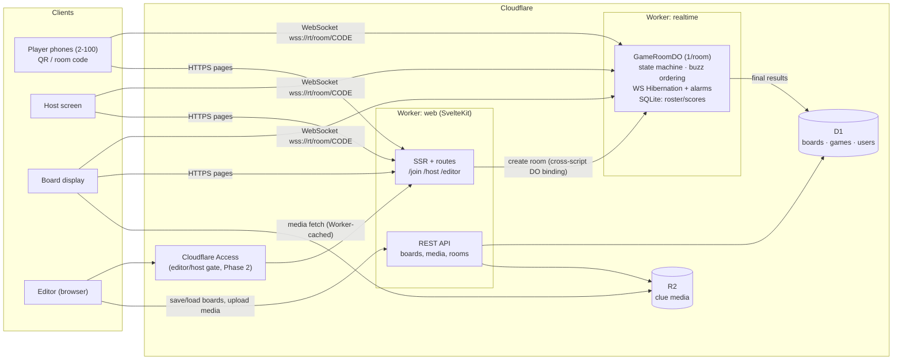

# Research: Self-Hosted Jeopardy Suite on Cloudflare + SvelteKit

> Research round 1 · Agent: Architecture · Verified against live sources 2026-08-13
> All prices/versions flagged for re-verification at build time (§8).

---

## 1. SvelteKit 3 / Svelte 5 status (as of Aug 2026)

**SvelteKit 3 is NOT stable yet.** It entered public prerelease in July 2026; as of the [August 2026 "What's new in Svelte" post](https://svelte.dev/blog/whats-new-in-svelte-august-2026), the latest is **`3.0.0-next.13`** ("It's a prerelease, but it's worth trying out"). So the condition "try SvelteKit 3 _if it's actually released_" is **not met today**, but stable release is plausibly weeks-to-months away. Re-check `sveltejs/kit` releases at build time.

**What SK3 changes vs SK2** (from the prerelease notes):

- `invalidateAll` → `refreshAll`; `error(status, message, {...})` requires explicit messages
- Shallow routing folded into `goto` (`state` option, `persistState`); `noScroll`/`keepFocus` consolidated into a `reset` option
- New `$app/manifest` and `$app/service-worker` modules (replacing `$service-worker`)
- Production sourcemaps; deployment-version detection/polling; form validation helpers (`dirty()`, `field.touched()`)
- Notably: SK3's headline items are **DX refinements, not an architectural rewrite** — the big architectural features (remote functions, async SSR) already shipped in the 2.x line.

**Svelte 5 is mature** (stable since Oct 2024; ~5.55+ now). Runes are the settled authoring model. **Remote functions** stabilized in the SvelteKit 2.x line (~2.57 era, maturing through 2.69/2.70), coupled with Svelte's async support — note that remote _queries_ require the async feature enabled ([kit#15966](https://github.com/sveltejs/kit/issues/15966) documents this coupling).

**Recommendation:** Start on **latest SvelteKit 2.x + Svelte 5**, keep the codebase free of deprecation warnings (use `refreshAll`, new error signature where available, avoid `$service-worker`). Migration risk 2→3 then looks **low** — the changes are deprecation-driven renames, and `sv migrate` will likely cover them. Optionally pin a CI job against `@sveltejs/kit@next` to detect breakage early. Do **not** ship on `3.0.0-next.*` for a project you want stable; flip to 3.0 when it GAs (likely before or during this build).

---

## 2. Cloudflare deployment model (2026)

**Pages is effectively legacy; Workers with Static Assets is the recommended path.** Cloudflare's own [migration guide](https://developers.cloudflare.com/workers/static-assets/migration-guides/migrate-from-pages/) and ecosystem consensus ([Bejamas](https://bejamas.com/stack/hosting/cloudflare), [mecanik.dev](https://mecanik.dev/en/posts/cloudflare-pages-vs-workers-which-to-use-in-2026/), [dev.to migration guide](https://dev.to/rickcogley/cloudflare-pages-vs-workers-in-2026-migration-guide-ka7)) confirm: Pages remains supported with no forced deadline, but **all new full-stack projects should target Workers** — critically for us, **Durable Objects, Cron Triggers, and full observability are Workers-only**. This project _requires_ DOs, so Workers is mandatory, not optional.

**How SvelteKit deploys to Workers today** ([adapter docs](https://svelte.dev/docs/kit/adapter-cloudflare)):

- `@sveltejs/adapter-cloudflare` (the single current adapter; old `adapter-cloudflare-workers` targeting Workers Sites is deprecated) builds to `.svelte-kit/cloudflare/`
- `wrangler.jsonc`: `main: ".svelte-kit/cloudflare/_worker.js"`, `assets: { directory: ".svelte-kit/cloudflare", binding: "ASSETS" }`, `compatibility_flags: ["nodejs_als"]`
- Static asset requests are **free** and served without invoking the Worker; dynamic/SSR/API requests invoke the Worker at normal Workers pricing
- Deploy: `wrangler deploy` or Workers Git integration (Workers Builds). Free `*.workers.dev` subdomain; custom domains via `routes` with `custom_domain: true` in wrangler config (dashboard or config-as-code)
- **Local dev:** `vite dev` with the adapter emulating bindings via Wrangler's `getPlatformProxy` (reads your wrangler config, gives you local D1/R2/KV/DO stubs on `platform.env`); full-fidelity check via `wrangler dev` against the built output
- **Observability:** set `observability: { enabled: true }` in wrangler config → Workers Logs (persisted, queryable in dashboard, includes DO logs); `wrangler tail` for live streaming; optional head sampling to control volume

---

## 3. Real-time buzzer architecture — Durable Objects

### One DO per room

`env.GAME_ROOM.idFromName(roomCode)` maps a human room code (e.g. 4–5 chars, `BQKX7`) directly to a DO instance — **no KV lookup table needed**. The DO is the single authoritative game-state machine: board state, revealed clues, buzzer lock state, scores, player roster. All clients (host screen, board display, player phones) hold WebSockets to it.

### WebSocket Hibernation API — required, and why

Verified against [DO WebSocket docs](https://developers.cloudflare.com/durable-objects/best-practices/websockets/) and [pricing](https://developers.cloudflare.com/durable-objects/platform/pricing/):

- Use `this.ctx.acceptWebSocket(ws, [tags])` (NOT `ws.accept()`), with handler methods `webSocketMessage(ws, msg)`, `webSocketClose`, `webSocketError` on the DO class
- When idle ≥10s, the DO is **evicted from memory while clients stay connected** — duration billing stops. With the standard (non-hibernation) API you'd pay wall-clock GB-s for the entire game including every silent moment
- `ws.serializeAttachment({...})` (≤16 KB/connection) survives hibernation — store `{playerId, role}` per socket
- `ctx.setWebSocketAutoResponse(new WebSocketRequestResponsePair("ping","pong"))` answers client heartbeats **without waking the DO** (and protocol pings are unbilled) — use this for phone keepalive
- `ctx.getWebSockets(tag)` recovers connections after wake; tags like `"player"`, `"host"`, `"display"` let you broadcast selectively
- **Persistence rule:** anything that must survive eviction (roster, scores, board snapshot, session tokens) goes in the DO's embedded **SQLite storage** (`ctx.storage`), not instance fields. Rebuild in-memory state lazily on wake.

### Message protocol (sketch — lives in shared `protocol` package, validated with zod)

```ts
// client → server
{ t: "join", name, sessionToken? }         // reclaim identity if token present
{ t: "buzz", clueId, seq }                  // seq for idempotent retry
{ t: "host:reveal", clueId } { t: "host:arm" } { t: "host:judge", playerId, correct }
{ t: "host:score:adjust", playerId, delta } { t: "host:lock" } { t: "host:end" }
// server → client
{ t: "welcome", sessionToken, playerId, roomState }   // full snapshot on join/reconnect
{ t: "state", patch }                                  // incremental room-state updates
{ t: "buzz:result", order: [{playerId, name, deltaMs}], winner }
{ t: "locked" } { t: "error", code, msg }
```

Design rules: server snapshot-on-connect + incremental patches (reconnect = re-snapshot, no replay log needed by clients); every host action is authorized by role stored in the socket attachment; all state transitions happen only in the DO.

### Buzz ordering & latency fairness (honest assessment)

- **Determinism is free:** a DO is single-threaded with input gates — concurrent `webSocketMessage` deliveries are serialized in arrival order. First-arrival-wins is exactly reproducible; there is no race to handle.
- **Fairness is not free.** Phone RTTs vary 20–300 ms (Wi-Fi vs LTE), so pure server-arrival order favors low-latency clients by up to ~a couple hundred ms. Options, in order of complexity:
  1. **Server-arrival order (baseline).** Simple, unspoofable, fine for casual same-room play where human reaction variance (±150 ms+) dwarfs network variance. Ship this first.
  2. **Buzz window + client-elapsed compensation (recommended enhancement).** When host "arms" the buzzer, the DO broadcasts `arm` and records send time. Client records `performance.now()` at arm-receipt and at buzz-press, sends `elapsedMs` with the buzz. DO opens a short collection window (~150–250 ms after the first buzz arrives), then ranks by `elapsedMs`. This compensates both directions of latency without clock synchronization. Anti-cheat: clamp `elapsedMs` to be consistent with the measured per-connection RTT (from the heartbeat) and with server arrival time — a client claiming an elapsed time implying faster-than-light delivery gets clamped to arrival order. Cost: adds up to ~250 ms to buzz resolution — imperceptible in Jeopardy flow.
  3. **Full NTP-style clock sync** — not worth it; option 2 achieves the same with less machinery and equal trust assumptions.
  - Be honest in docs: **any compensation scheme trusts client-reported timing to some degree**; the clamps bound cheating to roughly the client's real RTT advantage anyway.

### Reconnection (phone sleeps, network blips)

- On first join the DO issues a random **session token** (UUID) → stored in the phone's `sessionStorage` and in DO SQLite (`players` table: token, name, score). Reconnect with token → same identity/score; the socket attachment is re-established. Name-based reclaim as fallback with host approval.
- Client: auto-reconnect with jittered backoff; `visibilitychange` → immediate reconnect + heartbeat; server treats a duplicate connection for the same player as a takeover (close the old socket).
- Missing a buzz during a blip is acceptable; the snapshot-on-reconnect restores state instantly.

### Room lifetime — Alarms

- On every meaningful event, `ctx.storage.setAlarm(now + 60 min)` (sliding). `alarm()` handler: if no connections and no activity → persist final results to D1 (if the game was started from a saved board), `ctx.storage.deleteAll()`, and the room evaporates. Alarm invocations bill as ordinary requests (negligible). Also enforce a hard TTL (e.g. 12 h) so abandoned rooms always clean up.

### Cost math (verified pricing, Aug 2026)

Pricing ([source](https://developers.cloudflare.com/durable-objects/platform/pricing/)): requests $0.15/M after 1 M/mo (incoming WS messages billed 20:1, outgoing free, pings free); duration $12.50/M GB-s after 400k GB-s/mo, at 128 MB = 0.125 GB while awake; SQLite storage effectively free at this scale (5 GB incl.). **Free plan now includes SQLite-backed DOs**: 100k req/day, 13,000 GB-s/day.

Model: 5 simultaneous games/night, 100 players each, 2 h/game, 20 game-nights/month (100 games):

- **Messages:** ~100 players × ~60 clues × (1 buzz + chatter) ≈ 20k incoming msgs/game → ÷20 = 1,000 billable requests/game → 100k/month → **within the 1M included**
- **Duration (worst case, DO never hibernates during active play):** 7,200 s × 0.125 GB = 900 GB-s/game → 90,000 GB-s/month → **within the 400k included on the $5 Workers Paid plan**. Even unbounded, 90k GB-s ≈ $1.13. Realistically hibernation between clues cuts this further.
- **Free plan check:** 5 concurrent games/day = 4,500 GB-s/day (< 13,000) and ≪ 100k req/day → **this project plausibly runs on the free plan**; the $5/mo paid plan removes all doubt.
- **Bottom line: pennies. Dominant cost is the flat $5/mo Workers Paid subscription, if you even need it.**

---

## 4. Storage mapping

| Data                                         | Store                 | Why                                                                                                         |
| -------------------------------------------- | --------------------- | ----------------------------------------------------------------------------------------------------------- |
| Saved boards (metadata + canonical JSON doc) | **D1**                | Relational listing/search by owner, cheap, SQL, works with Drizzle                                          |
| User accounts / sessions (Phase 2)           | **D1**                | better-auth's native target                                                                                 |
| Clue media (images/audio)                    | **R2**                | Blob store, zero egress fees; serve via Worker route (auth + cache) or public bucket custom domain          |
| Live game state (roster, scores, buzz log)   | **DO SQLite storage** | Authoritative during play; survives hibernation/eviction; flushed to D1 as a `game_results` row at game end |
| Room-code → room mapping                     | **none**              | `idFromName(roomCode)` makes DO addressing implicit                                                         |
| KV                                           | **skip initially**    | No good fit; add later only for e.g. cached public board listings                                           |

**Uploads:** R2 supports S3-style presigned URLs, but for ≤ ~25 MB clue media the simpler, equally cheap path is a **Worker-proxied upload** (`PUT /api/media` → auth check → `env.MEDIA.put(key, request.body)`) — one auth model, no S3 credential plumbing, streams through without buffering. Enforce size/MIME limits in the Worker. Presigned URLs only become worth it for very large files.

**Schema sketch (D1).** Key decision: store the board as a **canonical JSON document + metadata columns** rather than fully normalized rows — the JSON doc _is_ the export format (one serializer, no impedance mismatch), the editor edits it as a unit, and there are no cross-board relational queries to justify normalization:

```sql
CREATE TABLE users    (id TEXT PRIMARY KEY, email TEXT UNIQUE, name TEXT, created_at INTEGER);
CREATE TABLE boards   (id TEXT PRIMARY KEY, owner_id TEXT REFERENCES users(id),
                       title TEXT NOT NULL, format_version INTEGER NOT NULL,
                       data TEXT NOT NULL,           -- canonical versioned JSON (see §6)
                       created_at INTEGER, updated_at INTEGER);
CREATE TABLE media    (key TEXT PRIMARY KEY, owner_id TEXT, board_id TEXT,
                       mime TEXT, bytes INTEGER, created_at INTEGER);  -- R2 object index
CREATE TABLE games    (id TEXT PRIMARY KEY, board_id TEXT, room_code TEXT,
                       status TEXT, started_at INTEGER, ended_at INTEGER,
                       results TEXT);                -- final scores JSON, written by DO at game end
```

Inside `data` (and mirrored as TS types): `board → rounds[] → categories[] (title, position) → clues[] (value, prompt, answer, media?: {key|url, kind}, dailyDouble, type: text|image|audio)` plus optional Final Jeopardy block.

---

## 5. Auth — honest options & phased recommendation

**Non-negotiable invariant: players never authenticate.** Room code (+ auto-issued session token) is the entire player join flow. QR code on the host screen encodes `https://app.example.com/join/BQKX7`. Auth questions apply only to the _editor/host_ side.

| Option                   | What it is                                                                                                                                                                   | Cost/effort  | Fit                                                                                                                                                                                                          |
| ------------------------ | ---------------------------------------------------------------------------------------------------------------------------------------------------------------------------- | ------------ | ------------------------------------------------------------------------------------------------------------------------------------------------------------------------------------------------------------ |
| (a) No accounts          | Boards in `localStorage` + JSON export/import (§6); anyone can host a room                                                                                                   | Zero         | Perfect MVP; risk: cleared browser storage loses boards (mitigated by export)                                                                                                                                |
| (b) Cloudflare Access    | Zero Trust gate on `/editor` + `/host` routes; free ≤50 users; zero app code; login via email OTP/Google                                                                     | ~1 hr config | **Ideal for a personal/family deployment** — this is a self-hosted suite, so likely the sweet spot                                                                                                           |
| (c) Lightweight accounts | [better-auth](https://github.com/zpg6/better-auth-cloudflare) on D1 (Drizzle/Kysely adapters; active Cloudflare integration package in 2026) with magic link and/or passkeys | Days         | For a multi-user public instance; better-auth is the current Svelte/Cloudflare community default (Lucia is deprecated/"learning resource"; oslo/arctic remain as low-level primitives better-auth builds on) |

**Recommendation — phased:** Phase 1 = (a) local-only with robust export/import. Phase 2 = (b) Cloudflare Access in front of editor/host for the personal deployment, storing boards in D1 keyed by the Access email (read from the `Cf-Access-Authenticated-User-Email` header — no auth code at all). Phase 3 (only if it becomes multi-tenant) = better-auth on D1 with magic-link + passkeys. Architect for it now by putting all board persistence behind one `BoardRepository` interface with `local` and `d1` implementations.

---

## 6. Import / export / upload / download

**Versioned JSON game format** (canonical, doubles as DB document and interchange file):

```jsonc
{
  "format": "jeopardy-board", // magic discriminator
  "version": 1, // integer; migrations are version→version+1 pure functions
  "meta": { "title": "...", "author": "...", "created": "..." },
  "rounds": [
    {
      "name": "Round 1",
      "categories": [
        {
          "title": "...",
          "clues": [
            {
              "value": 200,
              "prompt": "...",
              "answer": "...",
              "media": { "kind": "image", "ref": "media/abc.webp" },
              "dailyDouble": false,
            },
          ],
        },
      ],
    },
  ],
  "final": { "category": "...", "prompt": "...", "answer": "..." },
}
```

- **Media in exports:** two modes — "JSON only" (media refs become absolute URLs, portable within your instance) and "bundle" (zip of `board.json` + `media/` built **client-side** with `fflate`; import unzips client-side and re-uploads media). Keeps the Worker out of large-file memory territory.
- **CSV/spreadsheet import** for fast authoring: columns `round, category, value, clue, answer, [daily_double]`; parse **client-side** with Papa Parse; show a preview/repair UI before committing.
- **Where parsing lives:** all parsing/transforming client-side (free CPU, instant feedback, no Worker limits); the Worker **re-validates every saved document** against the same **zod schema imported from the shared protocol package** — one schema, two enforcement points. Never trust client-validated JSON.
- **Print export:** a `/board/[id]/print` route with print CSS (categories grid + answer key) — browsers' print-to-PDF beats server-side PDF generation for zero cost.

---

## 7. Project structure for modularity

**The one genuinely sharp edge found in this research:** `@sveltejs/adapter-cloudflare` **does not natively support exporting Durable Object classes** from the generated `_worker.js` ([kit#1712](https://github.com/sveltejs/kit/issues/1712), [cloudflare-docs#13062](https://github.com/cloudflare/cloudflare-docs/issues/13062)). DO classes must be named exports of the Worker entry, which the adapter generates. Two viable patterns:

- **(A) Single Worker via community shim:** [`sveltekit-add-worker-exports`](https://github.com/oselvar/sveltekit-add-worker-exports) (Vite plugin that merges your named exports into the build output), [`sveltekit-cloudflare-do`](https://github.com/The-LukeZ/sveltekit-cloudflare-do), or the [joshuadavidthomas adapter fork](https://github.com/joshuadavidthomas/sveltekit-adapter-cloudflare) (also supports `scheduled`/`queue` handlers). One deploy, one origin. Risk: depending on small community packages against a moving adapter.
- **(B) Two Workers (recommended):** `web` = SvelteKit app Worker (pages, editor, REST API, D1/R2). `realtime` = a small plain TypeScript Worker owning `GameRoomDO`, WebSocket-only. Phones connect directly to `rt.example.com/room/BQKX7/ws`. The web Worker reaches the same DOs via a cross-script binding (`durable_objects.bindings[].script_name = "realtime"`) for room creation/game-start. **Why B:** zero adapter hacks, officially supported config, the DO codebase stays a dependency-light module that `@cloudflare/vitest-pool-workers` tests natively (its `runInDurableObject` helper requires same-isolate DOs — awkward through a SvelteKit build, trivial on a plain Worker), and independent deploys. Cost: two `wrangler deploy`s and a CORS header.

**Layout — light pnpm monorepo:**

```
jeopardy/
├─ apps/web/            # SvelteKit 2.x (adapter-cloudflare), wrangler.jsonc
│  └─ src/lib/{board-editor, game-client, repositories}/   # modular feature folders
├─ apps/realtime/       # plain Worker + GameRoomDO, wrangler.jsonc (DO migrations live here)
├─ packages/protocol/   # WS message types + zod schemas + board format + version migrations
└─ packages/config/     # shared tsconfig/eslint
```

`packages/protocol` is the modularity keystone: client, SvelteKit server, and DO all import identical types and validators.

**Testing:** unit = vitest (board format migrations, protocol schemas, scoring logic as pure functions); DO integration = `@cloudflare/vitest-pool-workers` (v0.18.x; runs tests _inside_ workerd; `runInDurableObject`, and new June 2026 [`evictDurableObject` helpers](https://developers.cloudflare.com/changelog/post/2026-06-25-durable-object-eviction-test-helpers/) — perfect for testing hibernation-survival of game state); e2e = Playwright with **multiple browser contexts in one test** simulating host + N phones racing to buzz (assert deterministic ordering). Docs discipline: TSDoc on every protocol message + a `docs/` folder with the state-machine diagram.

**Accelerator worth evaluating:** Cloudflare's `partyserver`/`partysocket` libraries (PartyKit-style DX on native DOs) wrap hibernation, reconnection, and room routing — could replace ~a third of the hand-rolled realtime code. Verify maintenance status at build time.

---

## 8. Risks & unknowns — re-verify at build time

1. **SvelteKit 3 GA date** — currently `3.0.0-next.13`; check `sveltejs/kit` releases; if stable, start there (migration surface from a warning-free 2.x codebase is small).
2. **Remote functions ↔ experimental async coupling** — if using remote functions on 2.x, confirm the required `experimental.async`/compiler flags for the exact version pinned ([kit#15966](https://github.com/sveltejs/kit/issues/15966)).
3. **adapter-cloudflare DO export support** — watch for first-party support landing in the adapter (would collapse the two-Worker split into one); the community shims are small and could break with adapter updates.
4. **DO pricing/limits** — numbers above verified Aug 2026, incl. the Jan 2026 activation of SQLite storage billing; also note a [known docs pricing-example erratum](https://github.com/cloudflare/cloudflare-docs/issues/24138) — trust the pricing table, not blog examples.
5. **Hibernation behavior under sustained traffic** — with 100 sockets heartbeating, confirm auto-response pairs actually keep the DO hibernated between clues (measure GB-s in dashboard during a pilot game).
6. **`getPlatformProxy` local-dev fidelity for cross-script DO bindings** — multi-config `wrangler dev`/Vite plugin support for DO RPC across workers is actively evolving ([workers-sdk#9445](https://github.com/cloudflare/workers-sdk/issues/9445)); validate the local dev loop for the two-Worker setup in week 1.
7. **better-auth API churn** — only relevant if Phase 3 happens; re-survey then.
8. **D1 per-query/row limits** — irrelevant at this scale but confirm free-tier daily write limits cover editor autosave frequency.
9. **Workers free vs paid** — project likely fits free tier; budget $5/mo Workers Paid as the safe default.

---

## Recommended stack (summary)

| Layer           | Choice                                                                                                                           | Notes                                                                      |
| --------------- | -------------------------------------------------------------------------------------------------------------------------------- | -------------------------------------------------------------------------- |
| Framework       | **SvelteKit 2.x (latest) + Svelte 5 runes**                                                                                      | SK3 is prerelease (`3.0.0-next.13`); keep deprecation-clean, upgrade at GA |
| Hosting         | **Cloudflare Workers + Static Assets** (`@sveltejs/adapter-cloudflare`)                                                          | Pages is legacy; static asset requests free                                |
| Realtime        | **Durable Object per room** in a **separate `realtime` Worker**, WebSocket Hibernation API                                       | `idFromName(roomCode)`; auto-response heartbeats; alarms for cleanup       |
| Buzz fairness   | Server-arrival baseline → arm-window + client-elapsed compensation with RTT clamps                                               | Deterministic via DO single-threading                                      |
| DB              | **D1** (boards as versioned JSON docs + metadata, games, media index, users later)                                               | Drizzle ORM                                                                |
| Media           | **R2**, Worker-proxied uploads, Worker-served with cache                                                                         | Zero egress                                                                |
| Live game state | **DO SQLite storage**, results flushed to D1                                                                                     | Survives hibernation                                                       |
| Auth            | Phase 1: none (localStorage + export) → Phase 2: **Cloudflare Access** on editor/host → Phase 3: better-auth on D1               | Players: room code only, never accounts                                    |
| Interchange     | Versioned `jeopardy-board` JSON; CSV import (Papa Parse, client-side); zip bundles (fflate); zod validation shared client+server |                                                                            |
| Repo            | pnpm monorepo: `apps/web`, `apps/realtime`, `packages/protocol`                                                                  | Shared types = modularity keystone                                         |
| Testing         | vitest + `@cloudflare/vitest-pool-workers` (DO, eviction helpers) + Playwright multi-context buzz races                          |                                                                            |
| Cost            | **~$0–5/month** (likely free tier; ~$1.15/mo compute worst-case at 100 games/mo × 100 players)                                   | Math in §3                                                                 |

## Architecture diagram



**Sources:** [What's new in Svelte, Aug 2026](https://svelte.dev/blog/whats-new-in-svelte-august-2026) · [adapter-cloudflare docs](https://svelte.dev/docs/kit/adapter-cloudflare) · [kit#15966](https://github.com/sveltejs/kit/issues/15966) · [Pages→Workers migration](https://developers.cloudflare.com/workers/static-assets/migration-guides/migrate-from-pages/) · [Pages vs Workers 2026](https://mecanik.dev/en/posts/cloudflare-pages-vs-workers-which-to-use-in-2026/) · [DO pricing](https://developers.cloudflare.com/durable-objects/platform/pricing/) · [DO WebSockets/Hibernation](https://developers.cloudflare.com/durable-objects/best-practices/websockets/) · [kit#1712](https://github.com/sveltejs/kit/issues/1712) · [sveltekit-add-worker-exports](https://github.com/oselvar/sveltekit-add-worker-exports) · [sveltekit-cloudflare-do](https://github.com/The-LukeZ/sveltekit-cloudflare-do) · [adapter fork](https://github.com/joshuadavidthomas/sveltekit-adapter-cloudflare) · [better-auth-cloudflare](https://github.com/zpg6/better-auth-cloudflare) · [vitest-pool-workers eviction helpers](https://developers.cloudflare.com/changelog/post/2026-06-25-durable-object-eviction-test-helpers/) · [workers-sdk#9445](https://github.com/cloudflare/workers-sdk/issues/9445) · [docs pricing erratum #24138](https://github.com/cloudflare/cloudflare-docs/issues/24138)
